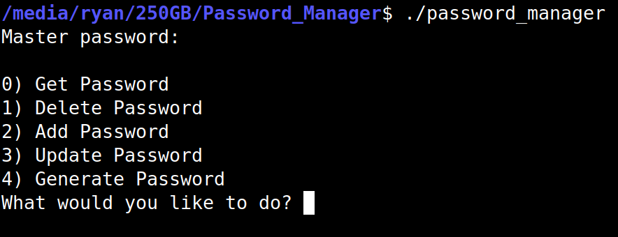
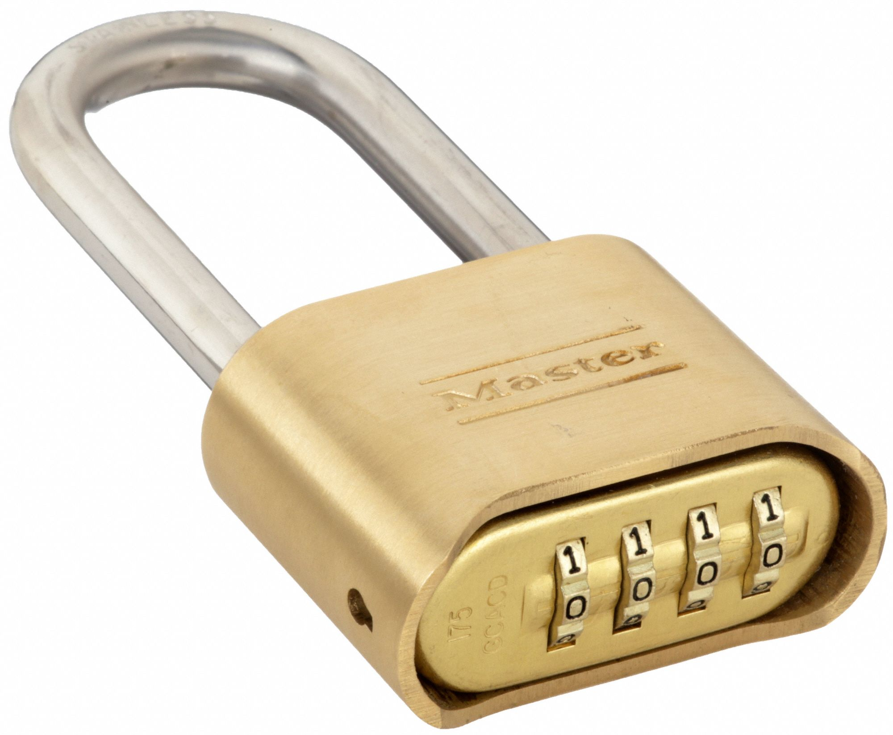

# Password Manager
A simple command line interface(CLI) password manger.



## How to run
- Compile with `make`
- Create a `.passwords` file in the same folder as `password_manager`
- Run: `./password_manager`
- Choose your master password

## How it works
Imagine you had a combination lock, but instead of the dials being from 0-9, they are all the characters you can type on the keyboard. Now, imagine that the lock doesn't have 4, but 64 different dials.



If you wanted to store one of your passwords, like one for a website, you could dial it on this modified combination lock. However, if someone else came by, they could see your password. This is like storing your passwords in a plain text file.

To solve this, you could remember 64 random numbers and rotate each dial upwards by its respective number. This would effectively scramble the password, so someone who sees it won't know your password.

Of course, remembering 64 random numbers is a little impractical. A better solution would be remembering a simple master password that can be used to generate those 64 random numbers.

If you wanted to store more than one password, you could have multiple combination locks, one for each password, scrambled with the same 64 random numbers. But if an attacker happened to guess one of your passwords, they could reverse engineer the random 64 numbers and use that to unscramble all your other passwords.

To prevent this, you could assign each lock an ID and use this ID, along with the master password, to generate the 64 random numbers. This would create unique 64 random numbers for each of your passwords.

Suppose you also wanted to store other information, like a name for which website they belong to and a username, alongside each password. You could add two more locks per password, one for the account name and another for the username, each scrambled using the same 64 random characters.

But what if an attacker happened to guess your name or username? They could then reverse engineer the random 64 characters and get your password. To solve this, you can use the field name ("name", "username", or "password") along with the ID and master password. This ensures each field generates unique 64 random characters, so that knowing one field won't allow you to unscramble the others.

### Visual overview
The hash uses 50 rounds of sha512.

```
hash(id + fieldName + masterPassword) -> -----------------hash------------------
                                         ------field value/encrypted value------
                                      xor__________________________________
                                         ------encrypted value/field value------
```

There are 3 fields: name, username, and password.